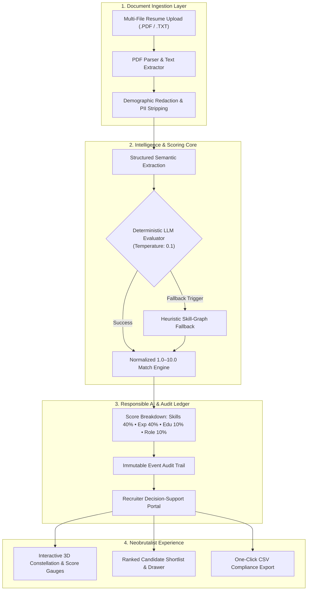

# Smart Resume Screener 🚀
### *Auditable Candidate Intelligence & Semantic Screening Engine*

[](https://github.com/Aneesh-20/Smart-Resume-Screener/actions)


---

## 📌 Executive Summary

**Smart Resume Screener** is an enterprise-grade, human-in-the-loop candidate screening and evaluation engine. It enables talent acquisition teams to ingest unstructured resume documents (.PDF/.TXT), extract structured technical competencies, and execute semantic candidate fit evaluations against defined job descriptions on an **explainable 1.0 – 10.0 scale**.

Built with a strict **Responsible AI & Anti-Bias architecture**, the engine strips demographic attributes prior to evaluation, provides evidence-backed match justifications, and records every model decision and human override into an **Immutable Audit Log** for regulatory compliance.

---

## 🏛️ System Architecture



---

## ✨ Key Engineering Highlights

- **🎯 Explainable 1.0 – 10.0 Multi-Factor Scoring**:
  Scoring is broken into 4 auditable dimensions:
  - **Technical Skills Match (40%)**: Explicit must-have and secondary competencies.
  - **Relevant Experience (40%)**: Years of domain-specific practice and impact.
  - **Education & Foundations (10%)**: Degree relevance and continuous learning.
  - **Domain & Role Alignment (10%)**: Project scope and operational scale.
- **🛡️ Responsible AI & Demographic Blind Evaluation**:
  Candidate names, genders, ages, and demographic identifiers are excluded from scoring prompts to mitigate algorithmic bias and support EEOC/OFCCP compliance.
- **⚡ Dual-Engine Reliability with Heuristic Fallback**:
  If external LLM APIs experience rate limits or downtime, the system automatically falls back to an offline rule-based semantic parser without halting recruitment pipelines.
- **🔒 Immutable Audit Trail**:
  Every job configuration, resume upload, automated evaluation, and recruiter adjustment is cryptographically timestamped and logged for full regulatory auditability.
- **🎨 Modern Neobrutalist UI with 3D Canvas**:
  Crafted in high-contrast Neobrutalism with custom 60% Sunset Fire gradients, interactive Three.js 3D physics gauges, and dynamic responsive drawer inspectors.

---

## 🛠️ Technology Stack

| Layer | Technology | Key Libraries & Standards |
|---|---|---|
| **Backend** | Python 3.11 / FastAPI | Uvicorn, SQLAlchemy, Alembic, SQLite, Pydantic v2, PyPDF2, pdfplumber |
| **AI / NLP** | OpenAI Adapter / Heuristics | Low-temperature deterministic prompts (T=0.1), JSON Schema validation |
| **Frontend** | React 18 / TypeScript / Vite | TanStack Query, TailwindCSS, Lucide Icons, Three.js, Canvas 3D |
| **DevOps & CI** | GitHub Actions / Docker | Ubuntu-latest CI workflow, Docker Compose, Vitest, Pytest |

---

## 🚀 Quickstart Guide

### Option 1: Docker Compose (Recommended)

Start the entire full-stack application with a single command:

```bash
git clone https://github.com/Aneesh-20/Smart-Resume-Screener.git
cd Smart-Resume-Screener
docker compose up --build
```

- **Frontend Application**: `http://localhost:5173`
- **Backend API Docs (Swagger)**: `http://localhost:8000/docs`
- **Health Check Endpoint**: `http://localhost:8000/health`

---

### Option 2: Local Development Setup

#### 1. Backend Setup (FastAPI)
```bash
cd backend
python3 -m venv .venv
source .venv/bin/activate
pip install -r requirements.txt
uvicorn app.main:app --reload --port 8000
```

#### 2. Frontend Setup (React + Vite)
```bash
cd frontend
npm install
npm run dev
```

Visit **`http://localhost:5173`** in your browser.

---

## 🧪 Testing & Quality Assurance

The codebase features comprehensive test suites spanning unit parsing, scoring algorithms, recruiter corrections, and UI components.

### Run Backend Pytest Suite (16 Tests)
```bash
cd backend
pytest -v
```

### Run Frontend Vitest Suite (4 Tests) & Typecheck Build
```bash
cd frontend
npm run test
npm run build
```

---

## 📂 Sample Data & Verification

Ready-to-use sample resumes and job descriptions are available in `sample-data/`:

- **Job Descriptions**: `sample-data/job_descriptions/` (Senior Full-Stack Engineer, Data Engineer)
- **Candidate Resumes**: `sample-data/resumes/` (6 realistic candidate profiles with varying skill fits)
- **PDF Generator Script**: Run `python3 sample-data/generate_sample_pdfs.py` to regenerate test PDFs at any time.

---

## 📡 API Reference Overview

| Method | Endpoint | Description |
|---|---|---|
| `GET` | `/health` | System health check and LLM adapter status |
| `GET` | `/api/v1/jobs` | List all active screening workflows |
| `POST` | `/api/v1/jobs` | Create a new screening job with threshold & skills |
| `GET` | `/api/v1/jobs/{id}` | Get workflow details and aggregate pipeline metrics |
| `POST` | `/api/v1/jobs/{id}/upload` | Multi-file resume upload (.PDF/.TXT) |
| `POST` | `/api/v1/screenings/jobs/{id}/run` | Execute AI candidate screening run |
| `GET` | `/api/v1/screenings/jobs/{id}/shortlist` | Get ranked candidate shortlist with score breakdown |
| `GET` | `/api/v1/screenings/jobs/{id}/export-csv` | Download complete candidate evaluation report (CSV) |
| `GET` | `/api/v1/screenings/audit` | Retrieve immutable audit event activity trail |

---

## ⚖️ License

Distributed under the **MIT License**. See `LICENSE` for more information.
