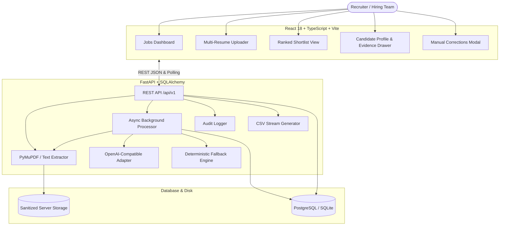

# 🎯 Smart Resume Screener

> **AI-Assisted Candidate Evaluation, Grounded Resume Extraction, and Auditable Shortlist Decision Support**

[](./LICENSE)
[](https://www.python.org/)
[](https://fastapi.tiangolo.com/)
[](https://reactjs.org/)
[](https://www.typescriptlang.org/)
[](https://vitejs.dev/)

---

## 📌 Human Oversight & Responsible AI Notice

> **IMPORTANT**: This tool supports recruiter decision-making; it **does not make automated or final hiring decisions**. All match scores (1.0–10.0), breakdown components, matched strengths, and qualification gaps are recommendations intended for human evaluation. In compliance with fair hiring guidelines, the system ignores demographic attributes and treats resumes as untrusted input data.

---

## 🚀 Key Features

1. **Intelligent Resume Ingestion**: Multi-file drag-and-drop parsing of `.pdf` and `.txt` files with SHA-256 deduplication and scanned PDF error detection.
2. **Grounded Fact Extraction**: Extracts normalized skills, structured experience timeline with bullet highlights, and educational credentials into queryable database models.
3. **Semantic Fit Scoring (1.0–10.0)**: Evaluates deep semantic fit against the job description across 4 components:
   - **Skills & Tech Stack** (/4.0)
   - **Relevant Work Experience** (/4.0)
   - **Education & Certifications** (/1.0)
   - **Role-Specific Criteria** (/1.0)
4. **Transparent Shortlist Decision Rules**: Explicit rule `Fit Score >= Threshold AND Recommendation == 'shortlist'`. All non-shortlisted candidates and reasons are inspectable to prevent black-box outcomes.
5. **Human-in-the-Loop Recruiter Corrections**: Edit extracted fields, fix parsing ambiguities, and trigger on-demand candidate re-scoring.
6. **Zero-Config Local Fallback**: When no `OPENAI_API_KEY` is provided, a transparent deterministic heuristic engine scores candidates, visibly labelled `Fallback - semantic LLM score unavailable`.
7. **Complete Audit Trail & CSV Export**: Track uploads, parses, edits, screenings, and exports with timestamps.

---

## 🏗️ Architecture & Data Flow



---

## ⚙️ Prerequisites & Quick Local Setup

### Prerequisites
- **Python 3.11+**
- **Node.js 18+** and **npm**
- *(Optional)* Docker and Docker Compose

---

### Option A: Local Development (Fastest Zero-Config Run)

#### 1. Clone the Repository
```bash
git clone https://github.com/your-username/smart-resume-screener.git
cd smart-resume-screener
```

#### 2. Backend Setup
```bash
cd backend
python3 -m venv .venv
source .venv/bin/activate    # On Windows: .venv\Scripts\activate
pip install -r requirements.txt

# Copy environment variables template
cp ../.env.example .env

# Run database migrations
alembic upgrade head

# Start FastAPI server
uvicorn app.main:app --reload --port 8000
```
*Backend runs on `http://127.0.0.1:8000` with Swagger docs at `http://127.0.0.1:8000/docs`.*

#### 3. Frontend Setup (In a new terminal)
```bash
cd frontend
npm install
npm run dev
```
*Frontend dashboard runs on `http://localhost:5173`.*

---

### Option B: Docker Compose (Full Stack with PostgreSQL)

```bash
# Start PostgreSQL, FastAPI Backend, and React Frontend in containers
docker-compose up --build
```
- Frontend: `http://localhost:5173`
- Backend API: `http://localhost:8000`
- PostgreSQL: `localhost:5432`

---

## 🧪 Running Automated Tests

### Backend Test Suite (Pytest)
```bash
cd backend
source .venv/bin/activate
pytest -v
```

### Frontend Test Suite (Vitest)
```bash
cd frontend
npm run test
```

### Frontend Type Check & Build
```bash
cd frontend
npm run build
```

---

## 🤖 LLM Prompt Templates & Configuration

Prompt templates are versioned as modular text files in `backend/app/prompts/` and documented in detail in [docs/LLM_PROMPTS.md](docs/LLM_PROMPTS.md):

- `extraction_v1.txt`: Factual candidate profile extractor with strict JSON schema instructions.
- `scoring_v1.txt`: Responsible hiring assistant evaluation prompt with 4-component score totaling 1.0–10.0 and bias protection.
- `repair_v1.txt`: Single-retry JSON schema repair prompt.

### Activating Real OpenAI / Compatible LLM
In `.env` or your environment:
```env
OPENAI_API_KEY=sk-your-actual-api-key
OPENAI_MODEL=gpt-4o-mini
OPENAI_BASE_URL=https://api.openai.com/v1
```

*When no API key is provided, the application runs on the built-in deterministic heuristic fallback and displays `Fallback - semantic LLM score unavailable` on assessments.*

---

## 📁 Repository Structure

```text
smart-resume-screener/
├── backend/
│   ├── app/
│   │   ├── api/v1/endpoints/  # REST endpoints: jobs, candidates, screenings, export, audit
│   │   ├── core/              # Config, security, logging, error handlers
│   │   ├── db/                # SQLAlchemy session & Base
│   │   ├── models/            # Normalized DB models (Job, Candidate, Skills, Assessment, Audit)
│   │   ├── repositories/      # Database query abstraction layer
│   │   ├── schemas/           # Pydantic 2 request/response schemas
│   │   ├── services/          # Extractor, LLM adapter, fallback engine, worker, audit
│   │   ├── prompts/           # Versioned prompt templates (extraction_v1, scoring_v1)
│   │   └── main.py            # FastAPI entrypoint
│   ├── alembic/               # Database schema migrations
│   ├── tests/                 # Comprehensive pytest test suite
│   ├── requirements.txt
│   └── Dockerfile
├── frontend/
│   ├── src/
│   │   ├── api/               # Typed API client functions
│   │   ├── components/        # UI primitives, Candidate Drawer, Shortlist Card, Dropzone
│   │   ├── pages/             # JobsListPage, JobDetailPage, NotFoundPage
│   │   ├── types/             # TypeScript schema interfaces
│   │   ├── utils/             # Formatters and score color styling
│   │   ├── App.tsx, main.tsx, index.css
│   ├── tests/                 # Vitest component unit tests
│   ├── package.json, vite.config.ts, tailwind.config.js
│   └── Dockerfile
├── docs/
│   ├── ARCHITECTURE.md        # Deep architecture & component design
│   ├── LLM_PROMPTS.md         # Production prompt templates & contracts
│   ├── API.md                 # REST API reference with JSON examples
│   ├── DEMO_SCRIPT.md         # 2-3 minute timed recruiter walkthrough script
│   └── REQUIREMENTS_TRACEABILITY.md # Traceability matrix for all specifications
├── sample-data/
│   ├── job_descriptions/      # Senior Fullstack Engineer, Data Engineer
│   └── resumes/               # Alice Chen (strong), Bob Martinez (partial), Charlie Davis (weak)
├── docker-compose.yml
├── .env.example
├── .gitignore
├── LICENSE
└── README.md
```

---

## 🔒 Security, Privacy & Production Hardening Notes

For enterprise production deployments, implement:
1. **Authentication & RBAC**: Integrate OAuth2 / OIDC (Okta, Auth0, Azure AD) with recruiter and hiring manager roles.
2. **Durable Task Queue**: Replace the in-process async worker with Celery / Redis or AWS SQS.
3. **Data Retention & Encryption**: Enforce TLS in transit, database column encryption for contact details, and automated resume file purge retention policies.
4. **Malware Scanning**: Scan uploaded PDF/text attachments with ClamAV before parsing.

---

## 📄 License

This project is licensed under the MIT License - see the [LICENSE](LICENSE) file for details.
