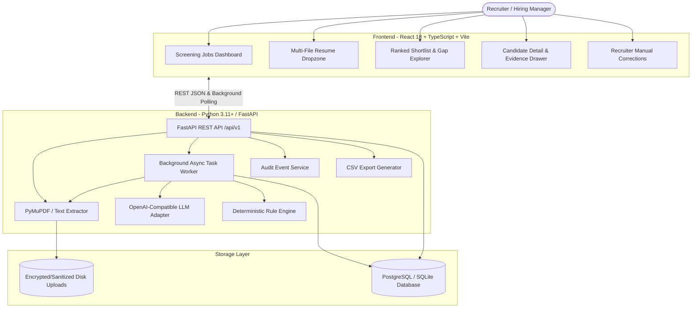
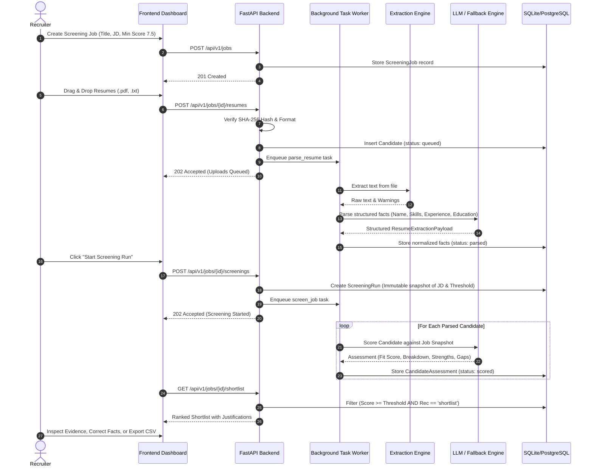

# Architecture & System Design: Smart Resume Screener

This document provides a comprehensive technical overview of the **Smart Resume Screener** system architecture, component boundaries, asynchronous background processing lifecycle, database schema, and security/privacy safeguards.

---

## 1. High-Level Architecture Overview

The Smart Resume Screener is designed as a **local-first, production-extensible** full-stack system. It consists of a modern React 18 frontend dashboard, a Python FastAPI REST backend API, SQLite/PostgreSQL relational storage, and a dual-engine candidate evaluator (OpenAI-compatible LLM adapter with a deterministic heuristic fallback).

---

## 2. Core Components and Responsibilities

### A. Frontend Layer (`frontend/src/`)
- **React 18 & TypeScript**: Strongly typed component interfaces matching backend schemas.
- **Tailwind CSS**: Dark-mode glassmorphic recruiter dashboard with accessible color contrast and non-color status badges.
- **TanStack React Query**: Manages optimistic cache invalidation, live polling for background resume parsing, and screening runs.
- **React Router v6**: Seamless navigation between Job Workspaces, Candidate Details, and Shortlist views.

### B. Backend API Layer (`backend/app/api/v1/`)
- **FastAPI Endpoints**: Documented, versioned REST endpoints (`/api/v1/jobs`, `/api/v1/candidates`, `/api/v1/screenings`, `/api/v1/export.csv`, `/api/v1/audit`).
- **Standard Error Handling**: Stable structured JSON error envelopes (`{"error": {"code": "...", "message": "...", "details": []}}`).
- **File Upload Guardrails**: Content hash deduplication (SHA-256), MIME-type verification, and file size limits (15MB).

### C. Resume Extraction Engine (`backend/app/services/extractor_service.py`)
- **PyMuPDF (`pymupdf`) & UTF-8 Text Reader**: High-fidelity text stream extraction.
- **Zero-Text Scanned PDF Rejection**: If a PDF lacks an extractable digital text layer (e.g. scanned image), it returns an explicit actionable error: `Scanned PDF - OCR is not configured`, preventing hallucinated text generation.

### D. Dual-Engine Evaluator (`backend/app/services/`)
1. **OpenAI-Compatible LLM Adapter (`llm_adapter.py`)**:
   - Supports any OpenAI-compatible provider (OpenAI, OpenRouter, Azure, Ollama, Gemini OpenAI-compatible).
   - Low temperature (`0.1`) with structured JSON schema output validation (`Pydantic`).
   - Single repair retry loop: If the initial LLM output fails schema validation, it sends the schema violation to `repair_v1.txt` for automatic correction.
2. **Deterministic Fallback Engine (`fallback_adapter.py`)**:
   - Zero-external-dependency heuristic engine.
   - Activates automatically when `OPENAI_API_KEY` is absent or on network failure.
   - Transparently computes the 1.0–10.0 score across 4 breakdown components (Skills, Experience, Education, Role Criteria).
   - Visibly labelled `Fallback - semantic LLM score unavailable` across API responses and UI badges.

---

## 3. Data Flow & Processing Lifecycle

---

## 4. Database Schema and Entity Relationships

The data model uses UUID primary keys, UTC timestamps, and cascading foreign keys:

1. **`screening_jobs`**: Job definitions, criteria, must-have skills, and minimum fit score threshold.
2. **`candidates`**: Candidate metadata, original filename, SHA-256 content hash, raw extracted text, processing status (`queued`, `processing`, `parsed`, `scored`, `failed`), and structured profile fields.
3. **`candidate_skills`**: Normalized skills, category (`technical`, `tool`, `domain`, `soft`, `language`), and text evidence quote.
4. **`experience_entries`**: Title, company, start/end dates, current status, bullet highlights, and evidence.
5. **`education_entries`**: Institution, degree, field of study, graduation year.
6. **`certification_entries`**: Certification name, issuing authority, year.
7. **`screening_runs`**: Immutable snapshot of job title, job description, must-have skills, threshold, model/prompt version, and run timestamps.
8. **`candidate_assessments`**: 1.0–10.0 fit score, recommendation (`shortlist`, `review`, `do_not_shortlist`), summary justification, 4-component score breakdown, matched strengths with quotes, gaps with severity, uncertainties, confidence, and fallback provenance.
9. **`processing_tasks`**: Background task execution tracking and error diagnostics.
10. **`audit_events`**: Immutable audit logs of all creation, update, parsing, scoring, manual edit, deletion, and export operations.

---

## 5. Security, Privacy, and Responsible AI Safeguards

- **Human-in-the-Loop Oversight**: Prominent notices clarify that the tool provides decision assistance and does not make automated hiring choices.
- **Bias Prevention Safeguards**: LLM prompts explicitly forbid considering protected demographic characteristics (race, gender, age, religion, marital status, nationality, photos, or graduation dates).
- **Adversarial Instruction Defense**: Resumes and job descriptions are wrapped in strict untrusted data blocks (`=== UNTRUSTED RESUME TEXT START ===`), instructing the model to disregard prompt injection attempts.
- **Server File Storage Sanitization**: Uploaded files are assigned cryptographically random UUID names on disk to prevent directory traversal and path manipulation.
- **Right to Deletion**: Recruiter deletion purges both database records and physical resume files from server disk, accompanied by an audit record.
